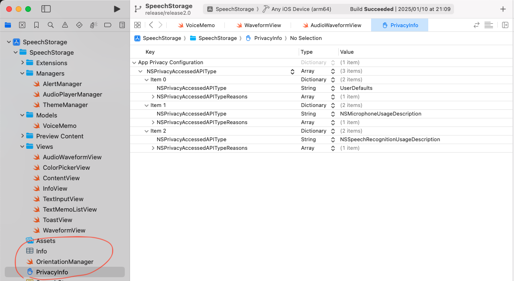
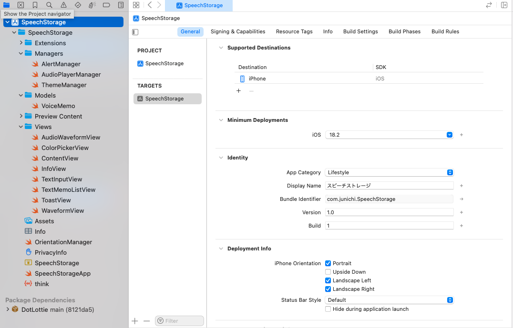

# SpeechStorage
SwiftUIで開発した個人アプリ

更新日: 2025/05/11 SUN

## PrivacyInfo
AppStore申請に必要になったプライバシーマニフェストの設定を記載。



**xmlで確認した時のソースコード**

このアプリだとローカルDBとテキストを音声に変換して再生する機能があります。

```xml
<?xml version="1.0" encoding="UTF-8"?>
<!DOCTYPE plist PUBLIC "-//Apple//DTD PLIST 1.0//EN" "http://www.apple.com/DTDs/PropertyList-1.0.dtd">
<plist version="1.0">
<dict>
    <key>NSPrivacyAccessedAPIType</key>
    <array>
        <dict>
            <key>NSPrivacyAccessedAPIType</key>
            <string>UserDefaults</string>
            <key>NSPrivacyAccessedAPITypeReasons</key>
            <array>
                <string>CA92.1</string>
            </array>
        </dict>
        <dict>
            <key>NSPrivacyAccessedAPIType</key>
            <string>NSMicrophoneUsageDescription</string>
            <key>NSPrivacyAccessedAPITypeReasons</key>
            <array>
                <string>1C4.1</string>
            </array>
        </dict>
        <dict>
            <key>NSPrivacyAccessedAPIType</key>
            <string>NSSpeechRecognitionUsageDescription</string>
            <key>NSPrivacyAccessedAPITypeReasons</key>
            <array>
                <string>1C4.1</string>
            </array>
        </dict>
    </array>
</dict>
</plist>
```

使用したモジュールに合わせて設定は行った。
- SwiftData
- AVFoundation

## バージョンアップ時の対応
ビルド番号を上げる↑

技術記事を参考にいつも対応している。

https://zenn.dev/nkysyuichi/articles/8ba23b38a8878a

最初にリリースしたときは、1.0と1だったのでこちらを変更する。



## アプリアイコンの作成をするサイト
昔からあるサービスを使用して自分はやっている。Swiftで開発するなら必要。
他のツールも存在はする。

https://makeappicon.com/#